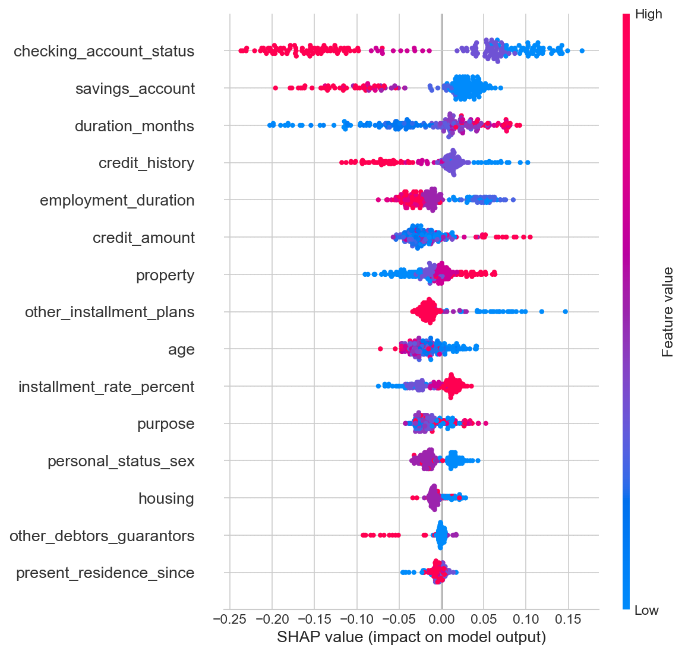
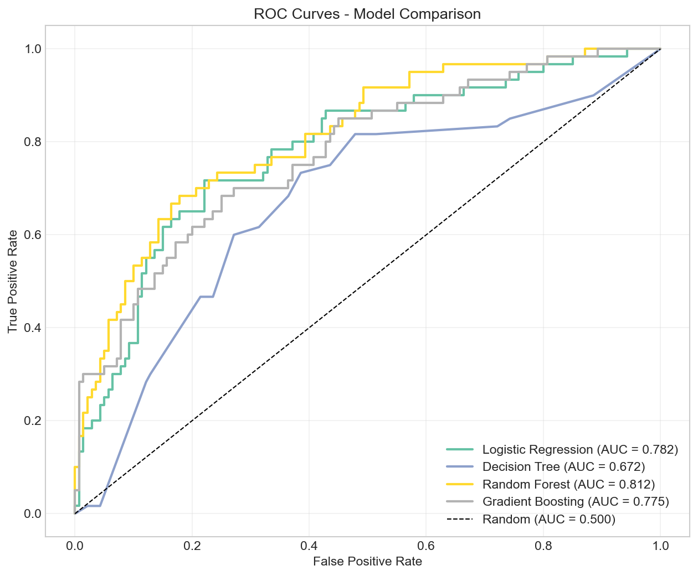
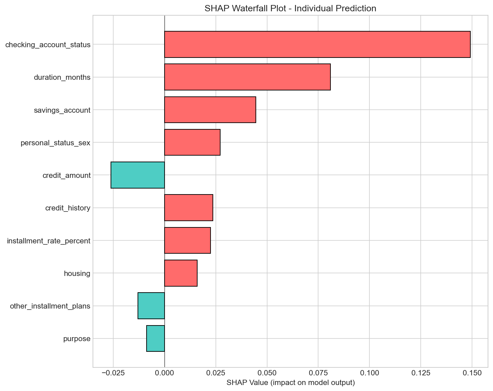
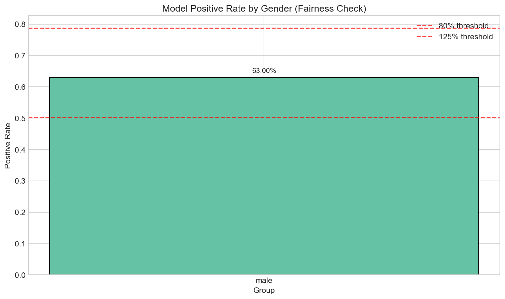

# Explainable AI for Credit Risk Decisions

A production-grade Explainable AI system for **Loan Default Risk Prediction** that combines classical ML with SHAP and LIME for transparent, auditable risk decisions.

## Problem Statement

This system predicts loan default risk while providing:
- **Global explanations**: What drives risk across all customers?
- **Local explanations**: Why was THIS customer flagged as high risk?
- **Fairness analysis**: Is the model biased against protected groups?

---

## Key Results

### Global Feature Importance (SHAP)


### Model Performance Comparison


### Individual Prediction Explanation


### Fairness Analysis


---

## Dataset

**South German Credit Dataset** (UCI ML Repository)
- 1,000 instances, 21 features
- Binary classification: Good/Bad credit risk
- [Source](https://archive.ics.uci.edu/dataset/573/south+german+credit)

## Tech Stack

- Python 3.10+
- Pandas, NumPy, Scikit-learn
- SHAP, LIME (Explainability)
- Matplotlib, Seaborn (Visualization)
- Jupyter Notebook

## Project Structure

```
├── data/                    # Dataset
├── notebooks/               # Main Jupyter notebook
│   └── xai_risk_decisions.ipynb
├── src/                     # Python modules
│   ├── data_loader.py       # Data loading utilities
│   ├── preprocessing.py     # Feature engineering
│   ├── models.py            # Model training
│   ├── explainers.py        # SHAP/LIME wrappers
│   └── fairness.py          # Bias analysis
├── outputs/
│   ├── figures/             # Visualizations
│   └── reports/             # Generated summaries
└── requirements.txt
```

## Quick Start

```bash
# Install dependencies
pip install -r requirements.txt

# Run the notebook
jupyter notebook notebooks/xai_risk_decisions.ipynb
```

## License

CC BY 4.0 (following dataset license)

## Citation

```
South German Credit [Dataset]. (2020). UCI Machine Learning Repository. 
https://doi.org/10.24432/C5QG88.
```
